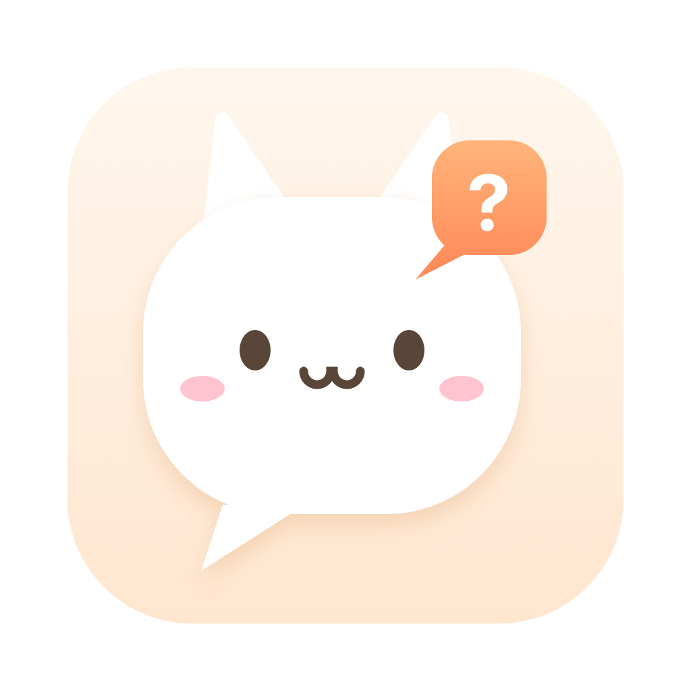

# zcode-touchbar

<p align="center">
  
</p>

在 MacBook **Touch Bar** 上操作 ZCode 的询问项:

- 🤖 **AI 提问**(AskUserQuestion):Touch Bar 点亮并显示每个选项一个按钮,点一下即作为你的回答发给 AI;
- 🔐 **工具权限确认**(Bash / Write / Edit 等):Touch Bar 显示「✓ 允许 / ✕ 拒绝」按钮;
- 📊 **菜单栏显示剩余额度**:点击菜单栏 💬 图标,下拉菜单里直接看 GLM Coding Plan 的 5 小时 / 本周窗口剩余百分比;
- 💤 无询问时 Touch Bar 完全交还前台应用,零占用。

全程**不模拟键盘、不需要辅助功能权限**。ZCode 的原生询问界面照常可用 —— Touch Bar 和界面是"先答先赢"的并行关系。

## 工作原理

```
ZCode (PermissionRequest hook, matcher *)
   │  stdin: 事件 JSON(问题/选项 或 工具名/风险)
   ▼
plugin/hooks/ask.sh + parse.jxa          TouchBarAgent (Swift LaunchAgent, 菜单栏 💬)
   │  写 request.json ──────────────────►  轮询发现新请求,写 ack.json
   │  ◄───────────────────────────────    Touch Bar 全条接管显示按钮
   │                                          │ 用户点选
   │  ◄─── response.json ──────────────    写回点选结果并收起
   ▼
stdout 决策 JSON:
   · 提问    → allow + updatedInput(把所选选项注入 answers 字段)→ AI 直接收到结构化答案
   · 权限    → allow(放行)/ deny + message(模型收到"用户通过 Touch Bar 拒绝了该操作")
```

关键事实:ZCode 引擎对 `PermissionRequest` hook 返回的 `behavior:"allow" + updatedInput` 会按 `decision:"modify"` 处理,而 AskUserQuestion 工具执行时只校验 `answers` 是否存在 —— 所以 Touch Bar 的点选与在界面上手点完全等价。

## 安装

### 第 1 步:安装 Touch Bar 助手(编译 + 登录自启)

```bash
bash scripts/install.sh
```

脚本会用 `swiftc`(Xcode Command Line Tools)把 `agent/TouchBarAgent.swift` 编译到
`~/Applications/ZCodeTouchBarAgent.app`(访达/启动台可见),并注册 LaunchAgent
`com.zpy.zcode-touchbar.agent`(登录自启;正常退出不拉起,崩溃自动重启)。
它是纯菜单栏应用(`LSUIElement`):不会出现在 Dock,运行中只有菜单栏一枚单色问号气泡。

> 助手使用与 MTMR/Pock 相同的 DFRFoundation 私有 API。若你的机型没有 Touch Bar 或系统
> 已移除相关 API,助手启动时会自动退出并在日志说明;此时插件仍可安全安装,只是所有询问
> 都走 ZCode 原生界面。

### 菜单栏额度显示

点击菜单栏 💬 图标,下拉菜单在「退出」上方会显示(数据每 5 分钟自动刷新,也可点
「刷新额度」手动拉取):

```
GLM Coding Plan（Lite）
5 小时窗口 剩余 70%（16:12 重置）
本周窗口 剩余 93%（9/10 14:54 重置）
刷新额度（更新于 16:17）
```

额度数据来自智谱开放平台的监控接口 `GET /api/monitor/usage/quota/limit`:

- **凭证来源**:自动读取本机 ZCode 配置 `~/.zcode/v2/config.json` 中当前选中的
  Coding Plan provider 的 `apiKey`(依据 `~/.zcode/v2/setting.json` 的选择项)。
  key **只在本机用于查询额度**,不做任何其他用途、不上报;
- **端点自动判断**:provider 的 `baseURL` 含 `bigmodel.cn` 走国内端点
  (`open.bigmodel.cn`),含 `z.ai` 走国际端点(`api.z.ai`);
- **手动覆盖**:设置环境变量 `ZCODE_TOUCHBAR_USAGE_API_KEY`(可选配合
  `ZCODE_TOUCHBAR_USAGE_URL`)可指定 key 与端点,优先于自动读取。
  注意助手由 launchd 拉起,需用 `launchctl setenv` 或在 LaunchAgent plist 的
  `EnvironmentVariables` 里设置才能生效;
- **查询失败时**(如 OAuth 模式下本地没有明文 key、网络异常):菜单里显示一行错误
  说明,不影响 Touch Bar 询问功能。

### 第 2 步:安装 ZCode 插件

**方式 A:从 GitHub 安装(推荐)**

1. 打开 ZCode → 设置 → **插件管理** → 市场/发现页 → 「+」**添加市场**;
2. 输入 GitHub 仓库:`GreendaMi/zcodeTouchBar`;
3. 安装列表中的 **zcode-touchbar**,重启 ZCode 会话。

**方式 B:从本地目录安装(开发调试用)**

1. 同上进入「+」添加本地市场,选择本仓库目录(含 `marketplace.json`);
2. 安装 **zcode-touchbar**。

> 注意:`marketplace.json` 发布版的插件源是 `git-subdir`(从本 GitHub 仓库拉取 `plugin/` 子目录),
> 本地目录方式安装时同样会从 GitHub 拉取 —— 修改代码后**需要先 push 才能装到新版**。
> 若要在推送前本地验证改动,可把 `plugins[0].source` 临时改回
> `{"source": "directory", "path": "/绝对路径/zcodeTouchBar/plugin"}`(绝对路径必须,
> 相对路径会因桌面端按自身工作目录解析而报 "Plugin source directory does not exist")。

插件声明了 `PermissionRequest` hook(`matcher: "*"`),装入后 ZCode 的 hook runner 自动启用。

## 验证

```bash
bash scripts/test-question.sh     # 模拟 AI 提问 → Touch Bar 显示 3 个选项,点选后打印决策 JSON
bash scripts/test-permission.sh   # 模拟权限确认 → Touch Bar 显示 允许/拒绝
```

在 ZCode 里实测:

| 场景 | 操作 | 预期 |
|---|---|---|
| AI 提问 | 让 AI "用 AskUserQuestion 问我一个问题" | Touch Bar 点亮 → 点选项 → AI 直接继续,不再等界面作答 |
| 权限放行 | 让 AI 跑一条需确认的 Bash 命令 | Touch Bar 点亮 → 点「✓ 允许」→ 命令执行 |
| 权限拒绝 | 同上,点「✕ 拒绝」 | 命令不执行,模型收到拒绝消息并说明下一步 |
| 界面并行 | Touch Bar 出现按钮后,直接在 ZCode 界面作答 | 界面优先生效;Touch Bar 超时(≤60s)后自动收起 |
| 助手未运行 | `launchctl bootout gui/$(id -u)/com.zpy.zcode-touchbar.agent` 后触发询问 | 2s 内静默降级,ZCode 原生询问完全正常 |

## 已知限制(v1)

- AskUserQuestion 一次问多个问题(2–4 个)或多选(`multiSelect`)时不接管,走原生界面;
- ExitPlanMode / EnterPlanMode(计划审批)不接管 —— 计划需要通读全文;
- 助手用 DFR 私有 API,macOS 大版本升级可能失效(失效即自动降级,不会影响 ZCode);
- 多个 ZCode 会话同时弹出询问时,Touch Bar 只显示最后一个,先答先赢。

## 卸载

```bash
bash scripts/uninstall.sh   # 停助手 + 删编译产物
```

再到 ZCode 插件管理里卸载 zcode-touchbar 插件即可。

## 排障

- **Touch Bar 不亮**:菜单栏有无问号气泡图标?没有则看 `~/Library/Application Support/zcode-touchbar/agent.log`;
- **日志无异常但不接管**:确认插件已安装且启用(插件管理页),`hooks.json` 的 matcher 是 `*`;
- **想要更长的点选窗口**:`ZCODE_TOUCHBAR_WAIT=120` 环境变量可加大等待秒数(hook 超时需同步 ≥ 该值);
- **菜单显示「额度：…」错误**:`额度：未读取到 ZCode API Key` 说明 `~/.zcode/v2/config.json` 里没有明文 key(常见于 ZCode 用 OAuth 登录),此时可在 ZCode 里改用 API Key 方式,或按上文用 `ZCODE_TOUCHBAR_USAGE_API_KEY` 手动指定;`HTTP 401/403` 说明 key 无效或不支持该接口。
